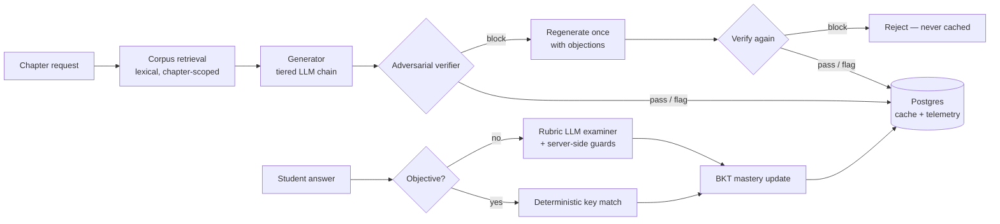

# Agentic CoLearn

A curriculum-grounded, adaptive learning platform for CBSE students (Grades 1–12): every lesson and practice question is generated from — and verified against — the official NCERT chapter texts, and every attempt updates a per-concept mastery model that drives what the student sees next.

The system combines three layers:

- **Grounded generation** — lessons, doubt answers, and board-typology questions are produced by an LLM that is restricted to ingested excerpts of official NCERT chapter PDFs, and an independent adversarial verifier tries to refute every artifact before it is stored.
- **Deterministic learning science** — Bayesian Knowledge Tracing (with partial credit), 2-PL Item Response Theory calibration, and FSRS-4.5 spaced repetition run as pure math with zero AI cost; the LLM layer never controls scores, mastery, or schedules.
- **A family-facing product** — chapter workspaces (Learn / Practice / Mock Test / Ask / Progress), Hindi/Telugu editions, Olympiad preparation, a parent report computed entirely from persisted data, and per-child profiles.

**Hosted deployment:** https://agentic-colearn.abacusai.app

## Architecture at a glance

- **Orchestration pattern:** per-request **generator–critic pipelines**. Each generation task (lesson, question batch) runs: retrieve chapter corpus → generate (grounded prompt) → adversarial verify → on `block`, regenerate once with the verifier's objections → persist or reject. Grading runs a separate deterministic-first pipeline (answer-key match, else rubric-LLM with server-side guards) that feeds the BKT update. A legacy lesson generator (`lib/teaching-agents.ts`, `/teach`) uses a sequential content stage followed by a **parallel fan-out** (visuals, videos, real-world links, assessment via `Promise.all`).
- **Models:** no single provider. A task-tiered router (`lib/model-router.ts`) maps each task to a fallback chain across OpenAI → Anthropic → Gemini → Groq → DeepSeek (`reasoning` / `standard` / `fast` tiers); providers without keys are skipped, so **any one API key activates the whole system**, and the math/objective-grading core works with zero keys.
- **Framework:** Next.js 14 (App Router) — 32 API routes as the entire backend; PostgreSQL via Prisma.
- **State:** all durable state is in Postgres — per-student `ConceptMastery` (BKT), `QuestionAttempt` with full structured feedback, per-language lesson caches on the chapter row, and an `AgentEvent` decision log (verifier verdicts, blocked content, provider fallbacks). Student identity is a cookie-selected profile by design (no fake auth; see [docs/HARDENING.md](docs/HARDENING.md)).
- **Retrieval:** chapter-scoped, in-process lexical ranking (tf–idf-style) over `ContentChunk` rows parsed from official `ncert.nic.in` PDFs — deterministic, zero embedding cost; an `embedding` column is reserved for a semantic upgrade. Web search, where used, is hard-restricted to five official Government of India education domains with the allow-list re-enforced on every result.



## Quickstart

Prerequisites: Node.js 18+, a PostgreSQL database.

```bash
git clone https://github.com/git-bonda108/agentic-colearn.git
cd agentic-colearn/nextjs_space

npm install --legacy-peer-deps

cp .env.example .env
# Set DATABASE_URL. Add at least one AI provider key for generation/grading;
# MCQ grading, BKT/IRT/FSRS, the parent report, study plan, and dashboard
# all work with zero keys.

npx prisma db push          # apply schema (idempotent)
npm run seed:curriculum     # 12 grades, 535 verified NCERT chapters, LOs, starter questions

# Optional but recommended — ingest official NCERT chapter PDFs (no AI cost):
npm run ingest:ncert -- --grade 10 --subject science

npm run dev
```

Expected output from `npm run dev`:

```
  ▲ Next.js 14.2.29
  - Local:        http://localhost:3000

 ✓ Starting...
 ✓ Ready in ...
```

Open http://localhost:3000 → `/learn` → any grade → any chapter for the five-tab workspace (Learn · Practice · Mock Test · Ask · My Progress).

## Configuration

All configuration is via environment variables (see `nextjs_space/.env.example`).

| Variable | Required | What it is / where to get it |
|---|---|---|
| `DATABASE_URL` | yes | PostgreSQL connection string (any Postgres instance) |
| `OPENAI_API_KEY` | any one of the five provider keys is enough | platform.openai.com — first choice in all tiers |
| `ANTHROPIC_API_KEY` | | console.anthropic.com — Claude models in the reasoning/standard/fast chains |
| `GEMINI_API_KEY` | | aistudio.google.com — Gemini 2.5 Pro/Flash |
| `GROQ_API_KEY` | | console.groq.com — Llama fallbacks |
| `DEEPSEEK_API_KEY` | | platform.deepseek.com — DeepSeek fallback |
| `TAVILY_API_KEY` | no | tavily.com — enables approved-domain web search only (five official `.nic.in`/`.gov.in` education domains) |
| `DAILY_LLM_CALL_CAP` | no | Hard daily ceiling on LLM calls (default 500; `0` disables). In-memory per process — see [docs/HARDENING.md](docs/HARDENING.md) |
| `ADVERSARIAL_VERIFY` | no | Set `0` to disable the verifier's LLM pass (deterministic checks still run) |

## Repository map

```
nextjs_space/
├── app/api/            32 API routes (lesson, ask, evaluate, questions/generate,
│                       test/assemble, diagnostic, review/queue, study-plan,
│                       parent/report, dashboard, knowledge-graph, olympiad, …)
├── app/                pages: /learn, /olympiad, /dashboard, /parent, /profiles, …
├── lib/                the engine (~4,500 lines):
│   ├── model-router.ts       tiered multi-provider fallback + daily cost cap
│   ├── corpus.ts             chapter-scoped lexical retrieval over NCERT text
│   ├── verifier.ts           adversarial verification (pass/flag/block/unverified)
│   ├── question-generator.ts CBSE + Olympiad typology question authoring
│   ├── evaluation.ts         deterministic + rubric-LLM grading with guards
│   ├── bkt.ts / irt.ts / fsrs.ts   the deterministic learning-science core
│   ├── ncert-codes.ts        official NCERT PDF code registry (en/hi/te)
│   ├── olympiad-data.ts      researched Olympiad exam registry
│   └── approved-search.ts    domain-allow-listed web search
├── prisma/schema.prisma      curriculum spine, assessment, mastery, telemetry
├── scripts/            seed, ingest, golden eval, IRT calibration, coverage checks
└── docs/               deployment, enhancement changelog, trusted-sources policy
```

## Documentation

- [docs/ARCHITECTURE.md](docs/ARCHITECTURE.md) — component map, orchestration analysis, state and context engineering, design trade-offs
- [docs/EVALUATION.md](docs/EVALUATION.md) — what is tested today (golden grading harness, offline checks, live smoke test) and what a fuller harness should add
- [docs/HARDENING.md](docs/HARDENING.md) — current security posture and the staged path to production
- [nextjs_space/docs/ENHANCEMENTS.md](nextjs_space/docs/ENHANCEMENTS.md) — the batch-by-batch changelog from persona-chat prototype to grounded platform
- [nextjs_space/docs/TRUSTED-SOURCES.md](nextjs_space/docs/TRUSTED-SOURCES.md) — the grounding policy: which sources are allowed, per feature
- [nextjs_space/docs/adaptive-engine-reference.md](nextjs_space/docs/adaptive-engine-reference.md) — engineering reference for BKT / IRT / rubric grading, with literature
- [nextjs_space/docs/DEPLOYMENT.md](nextjs_space/docs/DEPLOYMENT.md) — deployment runbook, environment, data jobs, verification
